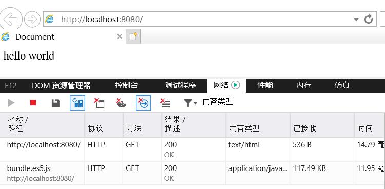
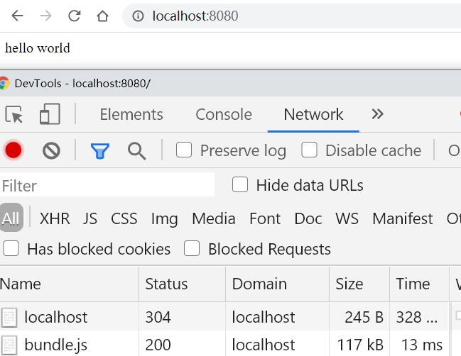
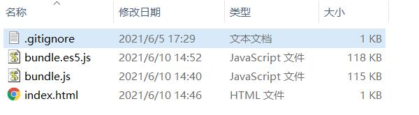

# webpack-es6-bundle-with-es5-fallback-example

本项目用于探索利用浏览器兼容ES标准能力引用不同资源达到提升用户体验的效果

## 1 使用常见的ES5打包

参考 [rollup.config.es5.js](./rollup.config.es5.js)

```
rollup -c rollup.config.es5.js
```

## 2 使用 ES6 打包

- 下载 [react](https://github.com/facebook/react) 代码
- 使用 [./react](./react) 替换 [react](https://github.com/facebook/react) 源码部分内容后，替换后的 react 源码放在 `./react`

参考 [rollup.config.js](./rollup.config.js)

```
rollup -c rollup.config.es5.js
```

## 3 开启 http 服务并测试

```
http-server ./dist
```




## 总结

虽然只少了 3KB，可能在有些场景也是有用的吧 
